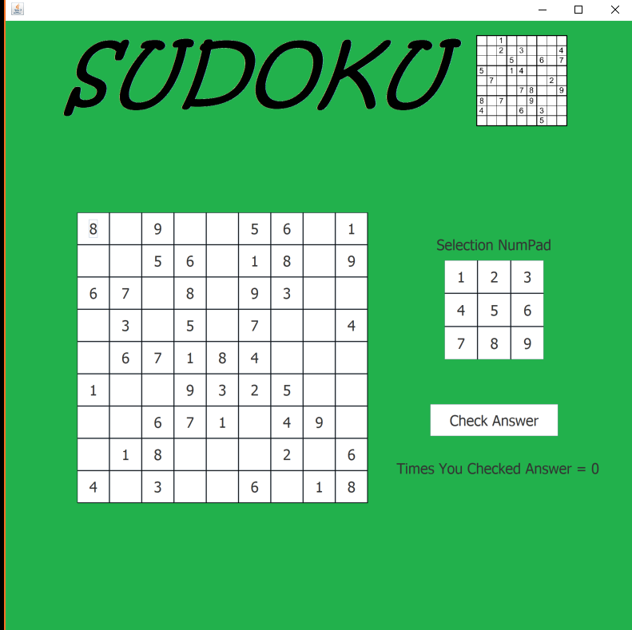
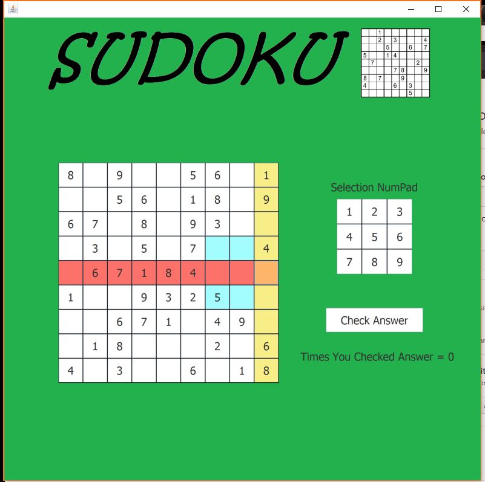
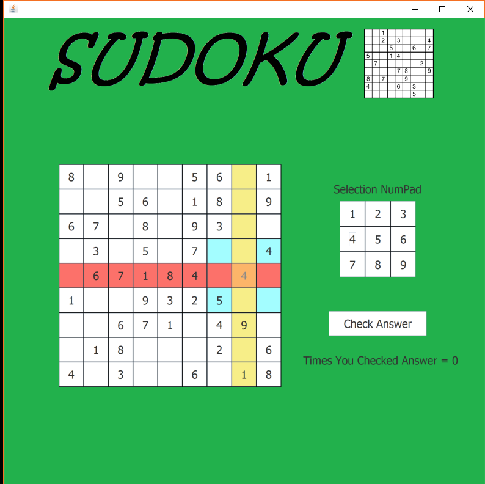

# Sudoku
### Desciption:
####  This program is a Sudoku puzzle generator that allows the user to play Sudoku with a user interface. The program was built in Java using Java Swing. The program runs on Linux, Windows and Mac devices. The program generates random boards and can generate up to 362,000 different boards. When the user selects an open space and the row, column and block light up different colors and highlights the users spaces that are relevant to the users current move. At any time the user may select the check answers button that will highlight wrong answers in red.

